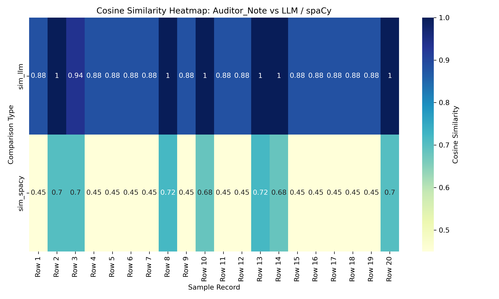

# 🧾 Audit Log AI Comparison

This project compares audit log summaries generated by a lightweight LLM (HuggingFace Transformers) vs traditional NLP (spaCy). Cosine similarity is computed and visualized using heatmaps.

## 📦 Files Included
- `Audit_Log_Insights.ipynb`: Main notebook for preprocessing, summarization, and visualization
- `audit_similarity_enriched.csv`: Enriched dataset with similarity scores
- `heatmap_audit_similarity.png`: Visual heatmap comparing LLM vs spaCy summaries

## 🔍 Methods Used
- TF-IDF + Cosine Similarity
- HuggingFace `pipeline("summarization")`
- spaCy `en_core_web_sm` for keyword extraction

## 📊 Visual Insight

## 🏷️ Tags
`nlp`, `audit`, `huggingface`, `spacy`, `heatmap`, `similarity`

